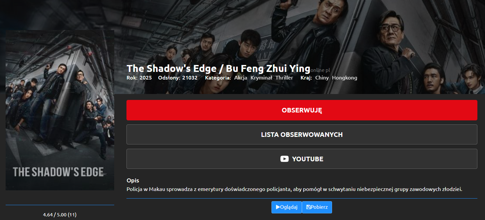
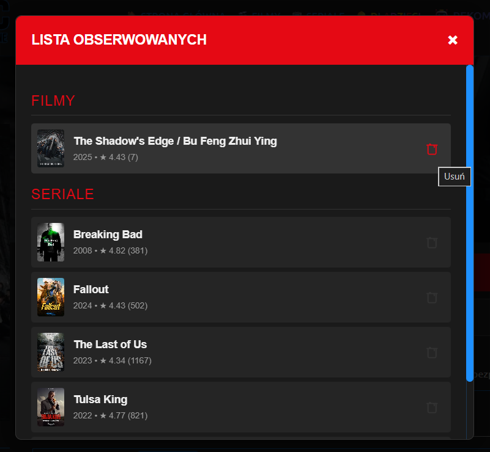
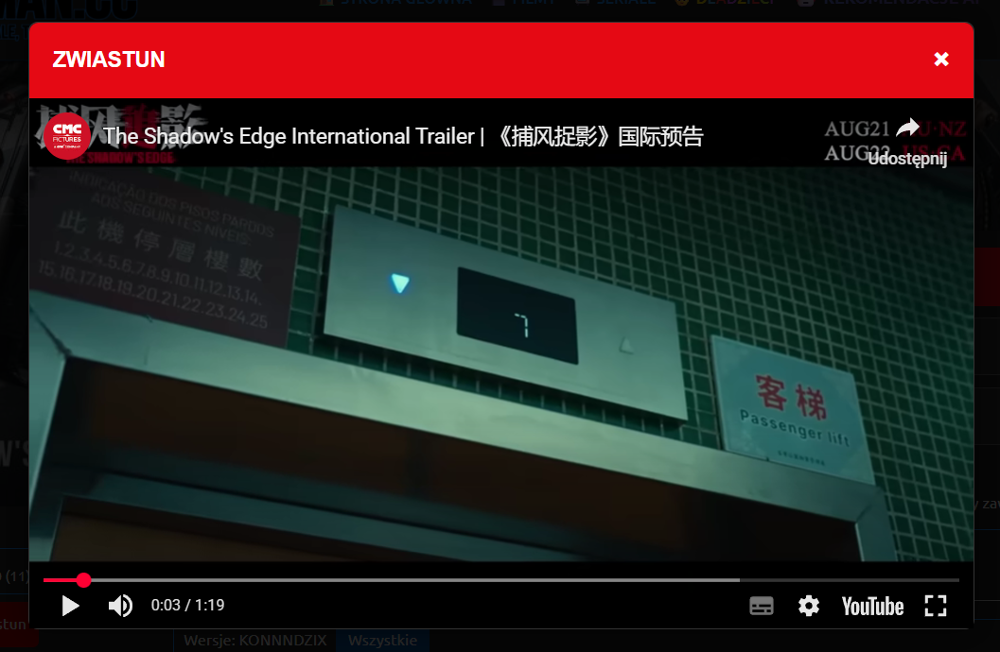

# 🧩 Kinoo TV - Chrome Extension


**Kinoo TV Extension** to dodatek do przeglądarki Google Chrome, stworzony jako **projekt edukacyjny (Proof of Concept)**. Rozszerza on funkcjonalność serwisu [filman.cc](https://filman.cc), integrując go z chmurą Firebase w celu synchronizacji listy obserwowanych filmów czy seriali.

> **Główny cel:** Rozszerzenie pełni rolę "kompana" dla aplikacji **[Kinoo TV](https://github.com/konradcz2001/KinooTV) na Android TV**. Pozwala wygodnie zarządzać biblioteką filmów na komputerze, aby natychmiast mieć do nich dostęp na dużym ekranie.

## 📱 Ekosystem Kinoo TV

To rozszerzenie ściśle współpracuje z aplikacją na TV. Dzięki wykorzystaniu wspólnej bazy danych **Firebase Realtime Database**, synchronizacja odbywa się w czasie rzeczywistym.

1. **Znajdź na PC:** Przeglądasz serwis na komputerze i znajdujesz ciekawy film.
2. **Kliknij "Obserwuj":** Rozszerzenie wstrzykuje przycisk bezpośrednio na stronę filmu.
3. **Oglądaj na TV:** Film natychmiast pojawia się w sekcji "Obserwowane" w aplikacji **Kinoo TV** na Twoim telewizorze.

## ✿Główne Funkcjonalności

* **DOM Injection:** Automatycznie wstrzykuje przyciski interfejsu (*Obserwuj*, *Lista*) w strukturę strony, używając `MutationObserver` (działa nawet przy dynamicznym ładowaniu treści).
* **Smart Scraping:** Pobiera metadane filmu (tytuł, rok, ocena, plakat, opis) bezpośrednio ze strony, aby wyświetlić je ładnie w aplikacji TV.
* **Integracja z YouTube:** Wyszukuje i odtwarza zwiastun filmu bezpośrednio w oknie pop-up, wykorzystując **YouTube Data API v3**. Inteligentnie dobiera tytuł (pomijając polskie tłumaczenia) dla lepszych wyników.
* **Status Oglądania:** Przycisk zmienia kolor i status (*Obserwuj* / *Obserwuję*) w zależności od tego, czy film jest już w Twojej bazie.
* **Bezpieczna Architektura:** Wykorzystuje lokalne biblioteki Firebase (zgodność z CSP i Manifest V3) oraz izolowany kontekst skryptów dla bezpieczeństwa kluczy API.
* **Podgląd Listy:** Wbudowany modal pozwala podejrzeć i zarządzać swoją listą obserwowanych bez wychodzenia ze strony filmu.

## 📸 Screenshots

<div align="center">
  
</div>

<div align="center">
  
</div>

<div align="center">
  
</div>

## 🛠︿Instalacja (Tryb Deweloperski)

Rozszerzenie nie jest dostępne w Chrome Web Store (jest to prywatny projekt edukacyjny). Aby je zainstalować:

1. **Sklonuj repozytorium**
2. **Skonfiguruj środowisko:**
   * Upewnij się, że w folderze `libs/` znajdują się pliki: `firebase-app.js`, `firebase-auth.js`, `firebase-database.js`.
   * Utwórz plik `config.js` w głównym katalogu (patrz sekcja Konfiguracja).
3. **Załaduj do Chrome:**
   * Otwórz przeglądarkę i wpisz w pasek adresu: `chrome://extensions`.
   * Włącz **Tryb dewelopera** (prawy górny róg).
   * Kliknij **Załaduj rozpakowane** (Load unpacked).
   * Wskaż folder z pobranym projektem.

## ⚙️ Konfiguracja

Ze względów bezpieczeństwa plik z kluczami API nie jest dołączony do repozytorium. Utwórz plik `config.js` w głównym katalogu projektu:

```javascript
export const firebaseConfig = {
    apiKey: "TWOJE_API_KEY",
    authDomain: "TWÓJ_PROJEKT.firebaseapp.com",
    databaseURL: "LINK_DO_BAZY_DANYCH" (np. "https://TWÓJ_PROJEKT-default-rtdb.europe-west1.firebasedatabase.app"),
    projectId: "TWÓJ_PROJEKT",
    storageBucket: "TWÓJ_PROJEKT.appspot.com",
    messagingSenderId: "NUMER",
    appId: "APP_ID",
    measurementId: "G-XXXXXX"
};

export const AUTO_LOGIN_EMAIL = "twoj_email@example.com";
export const AUTO_LOGIN_PASS = "twoje_haslo";

export const YOUTUBE_API_KEY = "TWOJE_YT_API_KEY";
```

## 📄 Licencja

Ten projekt jest udostępniony na licencji MIT - zobacz plik [LICENSE](LICENSE) po więcej szczegółów.
